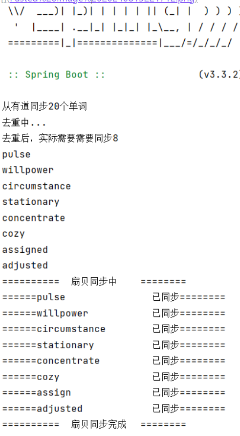

## 作用

- 拉取有道单词收藏单词本
- 将拉取到的单词进行去重操作后发送到扇贝单词的生词本

ps: 因为需要去重，所以引入了mysql进行单词的存储

## 如何使用
Mysql 版本 8.0.33

Java  版本 JDK17
1. 拉取代码
2. 拉取Maven依赖
3. 执行init.sql
4. 修改application-dev.yaml 文件，填入你的有道和扇贝的cookie、配置mysql连接数据
5. 运行

ps: 你可以通过修改配置文件中的 youdao.collectionUrl 的limit={单词数} 修改每次需同步的单词数

## 运行截图

